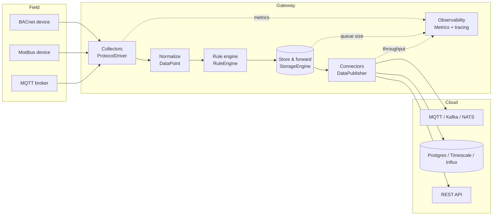
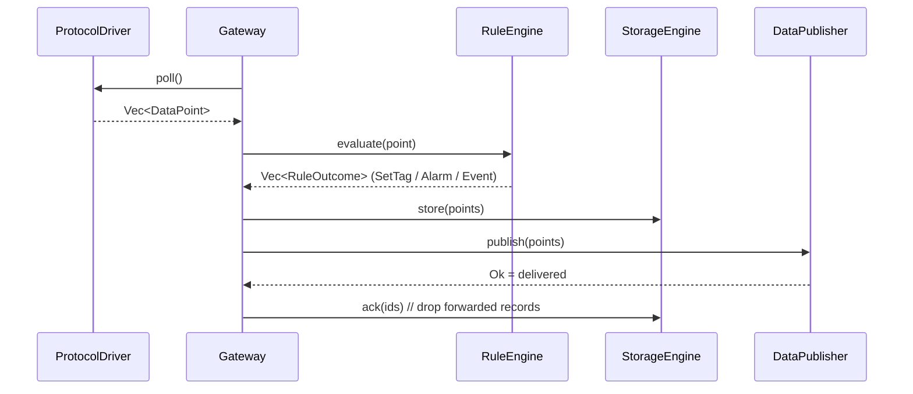

# Staircase

**Staircase** is a modular building-automation / industrial-IoT **edge gateway
framework** written in Rust. It collects data from field protocols (BACnet,
Modbus, OPC UA, MQTT, KNX, …), normalizes it into a single unified data model,
evaluates local edge rules, buffers it durably with store-and-forward, and
forwards it to messaging systems, databases, and APIs — all from a single,
protocol-independent API.

- **Async** on Tokio, **`#![forbid(unsafe_code)]`** throughout.
- **Open/closed by design:** new protocols, storage backends, and connectors are
  added by implementing a core trait in a new crate — existing code never changes.
- **Cargo workspace:** a tiny umbrella binary plus focused member crates.

---

## Architecture



Everything between the field and the cloud speaks one type: the normalized
[`DataPoint`]. No protocol-specific code leaks past the collectors.

### Data flow (one poll cycle)



If the connector is offline, `publish` errors, records stay buffered, and the
gateway replays them via `load_batch` → `publish` → `ack` once connectivity
returns.

---

## Workspace layout

| Crate | Responsibility | Status |
|-------|----------------|--------|
| `staircase-core` | Unified data model, core traits, errors, config, async runtime/supervision, observability | **Implemented** |
| `staircase-bacnet` | BACnet/IP driver (ReadProperty present-value over UDP) | **Implemented** |
| `staircase-modbus` | Modbus TCP driver (coils/discretes/holding/input registers) | **Implemented** |
| `staircase-mqtt` | MQTT inbound driver (topic subscription) | **Implemented** |
| `staircase-opcua` | OPC UA driver | Stub (future) |
| `staircase-knx` | KNX driver | Stub (future) |
| `staircase-storage` | RocksDB store-and-forward (`StorageEngine`) | Blueprint |
| `staircase-rules` | Edge rule engine (`RuleEngine`) | Blueprint |
| `staircase-connectors` | Output connectors: MQTT, Kafka, NATS, Postgres, Timescale, InfluxDB, REST (`DataPublisher`) | Blueprint (payload mapping implemented) |

> **Blueprint** crates compile and expose their real public types, config, and
> trait surfaces, with the behavioral bodies documented and filled in gradually.

---

## Core traits (the seams)

| Trait | Purpose |
|-------|---------|
| [`ProtocolDriver`] | Read a field protocol; normalize reads into `DataPoint`s |
| [`DataCollector`] | Higher-level source of `DataPoint`s (often wraps drivers) |
| [`RuleEngine`] | Evaluate a `DataPoint`, emit `RuleOutcome`s (set tag / alarm / event) |
| [`StorageEngine`] | Durable store-and-forward buffer (`store` / `load_batch` / `ack`) |
| [`DataPublisher`] | Forward `DataPoint`s to an external system (`connect` / `publish` / `close`) |

---

## Quickstart

```bash
# Build everything
cargo build

# Run the example gateway against the sample config
cargo run --example gateway              # uses examples/gateway.yaml
cargo run --example gateway my.yaml      # or your own config

# Tests, lints
cargo test --workspace
cargo clippy --workspace --all-targets
```

The example loads the YAML config, starts collectors (using the in-tree mock
driver so it runs without field hardware), normalizes data, runs it through the
pipeline, records metrics, and prints a metrics snapshot.

### Configuration

Configuration is YAML (see [`examples/gateway.yaml`](examples/gateway.yaml)):

```yaml
devices:
  - name: power_meter
    protocol: modbus
    address: 192.168.1.20:502
    poll_interval: 10
    tags:
      - name: voltage
        address: holding:40001
        data_type: u32
rules:
  - condition: "room_temp > 28"
    action: "supply_fan = true"
connectors:
  - name: cloud_mqtt
    type: mqtt
    settings:
      url: "tcp://broker.example.com:1883"
storage:
  path: ./data/staircase-store
observability:
  metrics_address: "0.0.0.0:9100"
  log_level: info
```

---

## Observability

`staircase-core` ships a lock-free [`Metrics`] registry shared across tasks,
plus a serializable `MetricsSnapshot`. Tracked: poll count & latency, protocol
errors, queue size, reconnect attempts, and throughput. Initialize structured
logging with `init_tracing("info")` (honors `RUST_LOG`). The example gateway
prints a `MetricsSnapshot` as JSON. The Prometheus exposition endpoint
(configured via `observability.metrics_address`) is a **blueprint** of the
gateway layer, filled in gradually.

---

## Extending Staircase

### Add a new protocol driver

No existing code changes — just implement [`ProtocolDriver`] in a new crate:

```rust
use async_trait::async_trait;
use staircase_core::error::Result;
use staircase_core::model::DataPoint;
use staircase_core::traits::ProtocolDriver;

pub struct MyDriver { /* connection state */ }

#[async_trait]
impl ProtocolDriver for MyDriver {
    fn protocol(&self) -> &str { "myproto" }

    async fn connect(&mut self) -> Result<()> { /* open transport */ Ok(()) }

    async fn poll(&mut self) -> Result<Vec<DataPoint>> {
        // read your protocol, map each reading into a normalized DataPoint
        Ok(vec![DataPoint::new("gw", "myproto", "dev1", "tag1", 42i64)])
    }
}
```

Then add the crate under `crates/`, register the device's `protocol` string in
the gateway's driver factory, and you're done.

### Add a new output connector

Implement [`DataPublisher`] (see `staircase-connectors`); reuse
`staircase_connectors::payload` for JSON / InfluxDB line-protocol mapping.

### Add a new storage backend

Implement [`StorageEngine`]; the `store` / `load_batch` / `ack` contract gives
you exactly-once forwarding for free.

---

## Development

- **Toolchain:** Rust stable.
- **Build:** `cargo build` · **Test:** `cargo test --workspace` ·
  **Lint:** `cargo clippy --workspace --all-targets`
- **Run:** `cargo run --example gateway` (also the `Start application` workflow).

## License

MIT.

[`DataPoint`]: https://docs.rs/staircase-core
[`ProtocolDriver`]: https://docs.rs/staircase-core
[`DataCollector`]: https://docs.rs/staircase-core
[`RuleEngine`]: https://docs.rs/staircase-core
[`StorageEngine`]: https://docs.rs/staircase-core
[`DataPublisher`]: https://docs.rs/staircase-core
[`Metrics`]: https://docs.rs/staircase-core
